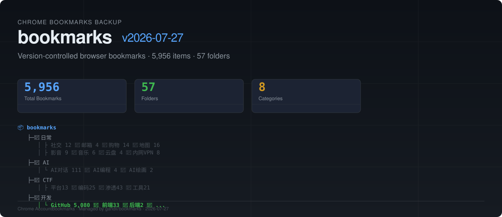

# 📑 bookmarks

<picture>
  <source media="(prefers-color-scheme: dark)" srcset="assets/readme/hero.svg">
  
</picture>

Version-controlled backup of Chrome bookmarks from the **gandli** browser profile.  
Includes **5,080 GitHub starred repositories** imported directly from the GitHub API.

## Structure

```
📁 日常 (73)     — 社交·邮箱·购物·地图·影音·音乐·云盘·内网VPN
📁 AI (118)      — AI对话·编程·绘画·API
📁 CTF (103)     — 平台·编码·渗透·工具·知识
📁 开发 (5,191)  — GitHub 5,080·前端·后端·移动端·工具链·其他
📁 设计 (170)    — 图标·配色·字体·插画·原型·灵感·样机·其他
📁 云服务 (37)   — VPS·国内云·BaaS·其他
📁 知识库 (115)  — Notion·笔记·博客周刊·阅读·教程
📁 工具 (149)    — 开发·在线·图片·网络·代理·政府·系统·临时邮箱
```

## Files

| File | Description |
|------|-------------|
| `AccountBookmarks` | Chrome native JSON format — drop-in replacement for `~/Library/Application Support/Google/Chrome/Default/AccountBookmarks` |
| `bookmarks_flattened.csv` | Flat table: `folder\|name\|url` — import into any spreadsheet or catalog |
| `SUMMARY.md` | Human-readable tree structure |

## Restore

```text
1. Close Chrome (completely)
2. cp AccountBookmarks ~/Library/Application\ Support/Google/Chrome/Default/
3. Open Chrome — bookmarks are in place
```

## License

The bookmark data is user-collected content. The backup scripts and tooling are MIT.
